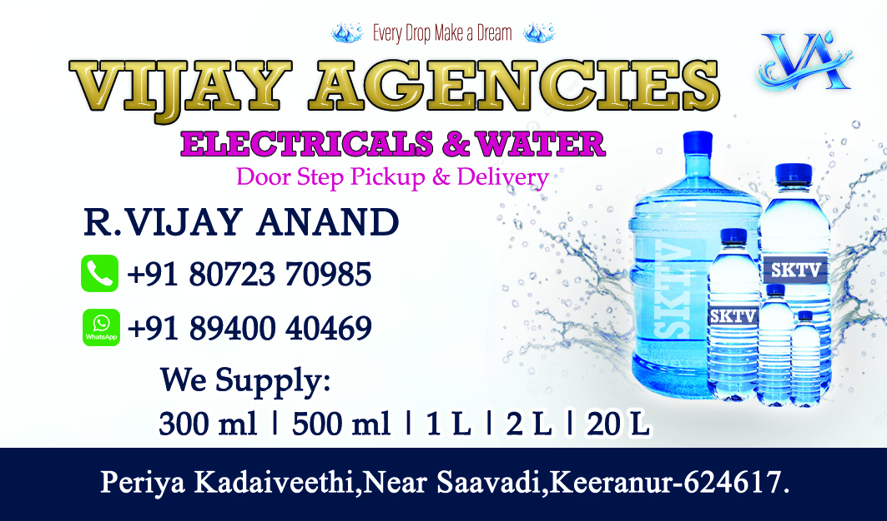
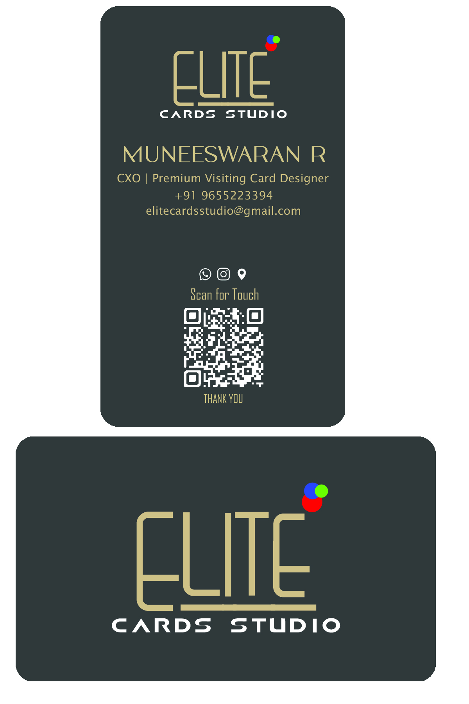
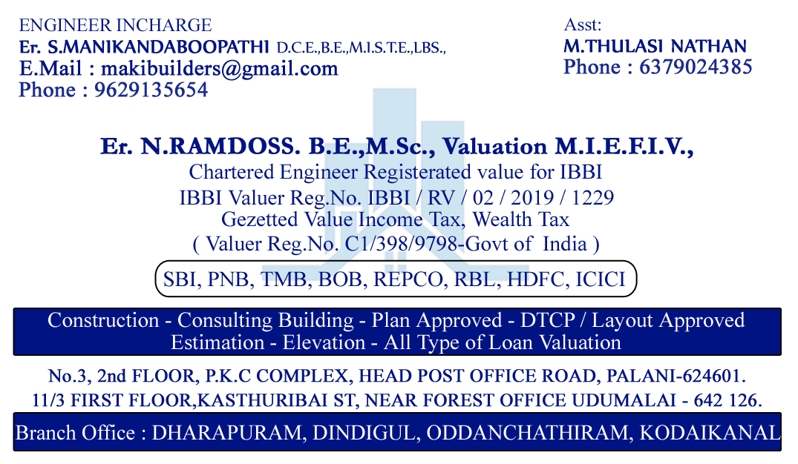

<html lang="en">

<head>

<meta charset="UTF-8">
<meta name="viewport" content="width=device-width, initial-scale=1.0">

<title>Elite Cards Studio</title>

<link href="https://fonts.googleapis.com/css2?family=Playfair+Display:wght@700&family=Poppins:wght@400;500;600&display=swap" rel="stylesheet">

</head>

<body>

ELITE

CARDS STUDIO

Muneeswaran R

CXO | Creative Director

<a href="tel:+919655223394" class="btn">📞 Call</a>

<a href="https://wa.me/919655223394" class="btn">💬 WhatsApp</a>

<a href="#" onclick="downloadContact()" class="btn">💾 Save</a>

<a href="mailto:elitecardsstudio@gmail.com" class="btn">📧 Email</a>

<a href="#" onclick="openDesign()" class="btn">🎨 Designs</a>

<a href="https://yourwebsite.com" class="btn">🌐 Website</a>

Crafting Premium Identity for Modern Professionals

<!-- ✅ POPUP OUTSIDE CARD -->

✖

</body>
</html>