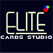

<html lang="en">
<head>
<meta charset="UTF-8" />
<meta name="viewport" content="width=device-width, initial-scale=1.0" />
<title>Elite Cards Studio | Digital Card</title>

</head>

<body>

  

    
    
<!-- NFC TAP HINT -->

  

  Tap NFC Card
   

    
ELITE

    
CARDS STUDIO

    
Muneeswaran R

    
Premium Visiting Card Designer

    <a class="btn" href="tel:+919655223394">📞 Call Now</a>

    <a class="btn"
      href="https://wa.me/919655223394?text=Hello%20Elite%20Cards%20Studio%2C%20I%20need%20premium%20visiting%20cards">
      💬 WhatsApp
    </a>

    

      <a class="btn small" href="mailto:elitecardsstudio@gmail.com">📧 Email</a>
      <a class="btn small" href="Elite_Cards_Studio.vcf" download>💾 Save Contact</a>
      <a class="btn small" href="https://maps.google.com">📍 Location</a>
      <a class="btn small" href="upi://pay?pa=9655223394@jupiteraxis&pn=Elite%20Cards%20Studio&cu=INR">💳 Pay</a>
    

    <a class="btn" href="https://g.page/r/REPLACE_REVIEW_LINK">⭐ Google Review</a>

    <a class="btn" href="#"
       onclick="navigator.share ? navigator.share({title:'Elite Cards Studio',url:location.href}) : alert('Share this link');">
      🔗 Share Card
    </a>

    

      Luxury NFC Visiting Cards • Digital Business Cards • Corporate Bulk Business Cards • Letterheads • QR Code & Smart Profiles
    

  

</body>
</html>