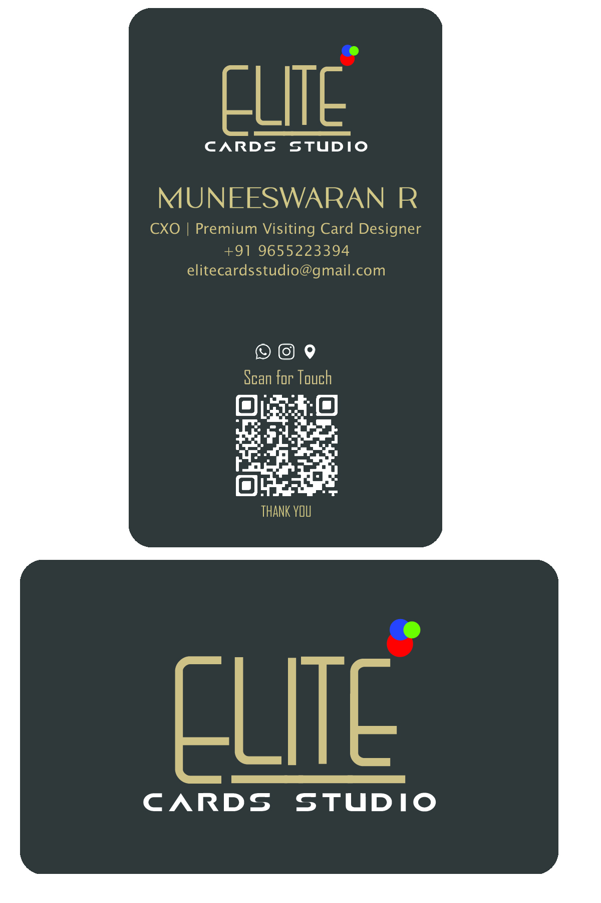
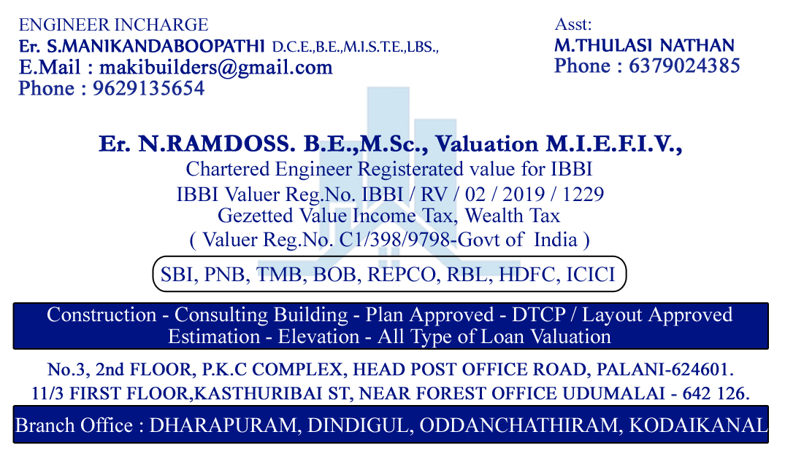
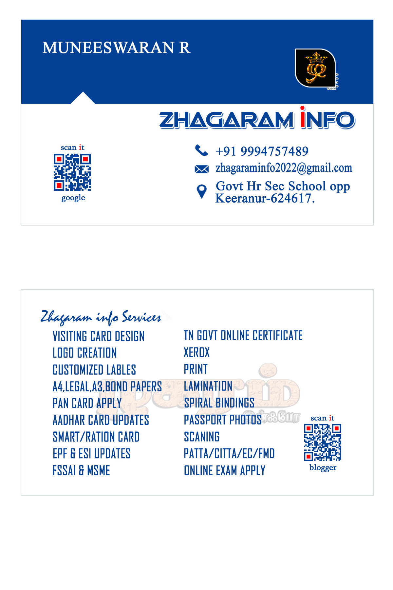

<html lang="en" style="scroll-behavior:smooth;">
<head>
<meta charset="UTF-8">
<meta name="viewport" content="width=device-width, initial-scale=1.0">
<title>Elite Cards Studio</title>
<link rel="preconnect" href="https://fonts.googleapis.com">
<link href="https://fonts.googleapis.com/css2?family=Playfair+Display:wght@700&family=Poppins:wght@400;500;600&family=Fraunces:opsz,wght@9..144,400;9..144,500;9..144,600;9..144,700&family=Space+Grotesk:wght@400;500;600;700&family=IBM+Plex+Mono:wght@400;500&display=swap" rel="stylesheet">

</head>
<body>
<!-- =========================================================
     SECTION 1 -- PROFILE / DIGITAL CARD
========================================================= -->

  

    
    
ELITE

    
CARDS STUDIO

    
Muneeswaran R

    

    
CXO | Creative Director

    

      <a href="tel:+919655223394" class="btn">📞 Call</a>
      <a href="https://wa.me/919655223394" class="btn">💬 WhatsApp</a>
      <a href="#" onclick="downloadContact()" class="btn">💾 Save</a>
      <a href="mailto:elitecardsstudio@gmail.com" class="btn">📧 Email</a>
      <a href="https://maps.google.com/?q=Elite+Cards+Studio" class="btn">📍 Location</a>
      <a href="upi://pay?pa=9655223394@axisbank&pn=Muneeswaran&cu=INR" class="btn">💳 UPI</a>
      <a href="#" onclick="openDesign()" class="btn">🎨 Designs</a>
      <a href="#" onclick="openOrder();return false;" class="btn order-cta">✍️ Order Here</a>
    

    

      Luxury Business Cards | Digital Cards | QR Virtual Card | Premium Texture Cards | Spot UV Cards
    

  

  
Order form below

<!-- POPUP -->

  ✖
  

    
    
    
  

<!-- =========================================================
     SECTION 2 -- ORDER FORM
========================================================= -->

  <button type="button" class="modal-close" onclick="closeOrder()" aria-label="Close order form">✕</button>
  

    <header>
      

        
EC

        

          <h1>Elite Cards Studio</h1>
          
Business Card Print Order

        

      

      

        Docket No. <b id="docketPreview">ECS-000000</b> 
        
      

    </header>

    

      Fill in your details, upload your front and back artwork, and confirm your specification. We print gloss, matt, synthetic, metallic and textured finishes, single or double sided.
      Front &amp; back artwork required
    

    

      

        
Proof previewSINGLE SIDE

        

          

            

              
AFront artwork appears here

              
            

            

              
BBack artwork appears here

              
            

          

        

        
tap the card to flip · front / back

        

          
FinishGloss Cards

          
SidesSingle side

          
Quantity500 pcs

          
Design serviceNot needed

          
Estimated total<b id="qTotal">₹599</b>

          
Estimate from our current rate card. Final price is confirmed on the phone once artwork is reviewed. Prices in INR.

        

      

      

        <form id="orderForm">

          

            
1<h2>Contact details</h2>

            

              
<label class="required" for="fullName">Full name</label><input type="text" id="fullName" required placeholder="e.g. Arun Kumar">

              
<label class="required" for="phone">Phone / WhatsApp number</label><input type="tel" id="phone" required placeholder="e.g. 98765 43210">

            

            

              
<label for="email">Email</label><input type="email" id="email" placeholder="e.g. arun@email.com">

              
<label for="company">Company / title on card</label><input type="text" id="company" placeholder="e.g. Arun Kumar, Interior Designer">

            

          

          

            
2<h2>Delivery address</h2>

            
<label class="required" for="addr1">Address line</label><input type="text" id="addr1" required placeholder="Flat / building, street, area">

            

              
<label class="required" for="city">City</label><input type="text" id="city" required>

              
<label class="required" for="state">State</label><input type="text" id="state" required>

              
<label class="required" for="pin">PIN code</label><input type="text" id="pin" required inputmode="numeric">

            

            
<label for="landmark">Landmark (optional)</label><input type="text" id="landmark" placeholder="Nearby landmark for the courier">

          

          

            
3<h2>Card specification</h2>

            

              
<label class="required" for="finish">Finish / type</label><select id="finish"></select>

              
<label class="required" for="sides">Sides</label>
                <select id="sides"><option value="single">Single side</option><option value="double">Double side</option></select>
              

              
<label class="required" for="qty">Quantity</label><select id="qty"></select>

            

            <label class="checkline"><input type="checkbox" id="needDesign"> I need the studio's designer to create my artwork (+ ₹350 design charge, where applicable)</label>
          

          

            
4<h2>Upload artwork</h2>

            

              <label class="dropzone" id="dzFront">
                <input type="file" id="fileFront" accept="image/*,.pdf,.ai,.psd">
                
⤒

Front side

Image or PDF, print-ready

                

              </label>
              <label class="dropzone" id="dzBack">
                <input type="file" id="fileBack" accept="image/*,.pdf,.ai,.psd">
                
⤓

Back side

Image or PDF, print-ready

                

              </label>
            

          

          

            
5<h2>Special instructions</h2>

            
<label for="notes">Anything we should know -- colours, urgency, reference card, etc.</label><textarea id="notes" placeholder="Optional"></textarea>

          

          

            <button type="submit" class="btn-primary">Submit order</button>
            
          

        </form>

        

          

            ✓ RECEIVED
            <h3>Order docket ready</h3>
            
Docket No.  · 

            

            

              <button type="button" class="btn-primary" id="waBtn">Send to studio on WhatsApp</button>
              <button type="button" class="btn-gold" id="emailBtn">Send to studio by Email</button>
              <button type="button" class="btn-ghost" id="editBtn">Edit this order</button>
              <button type="button" class="btn-ghost" id="newOrderBtn">＋ Create new order</button>
            

          

        

      

    

    <footer>Elite Cards Studio -- this form prepares your order docket in your browser. Attach the front/back artwork files manually when you send it over WhatsApp or email, as browsers can't attach files automatically.</footer>

  

</body>
</html>